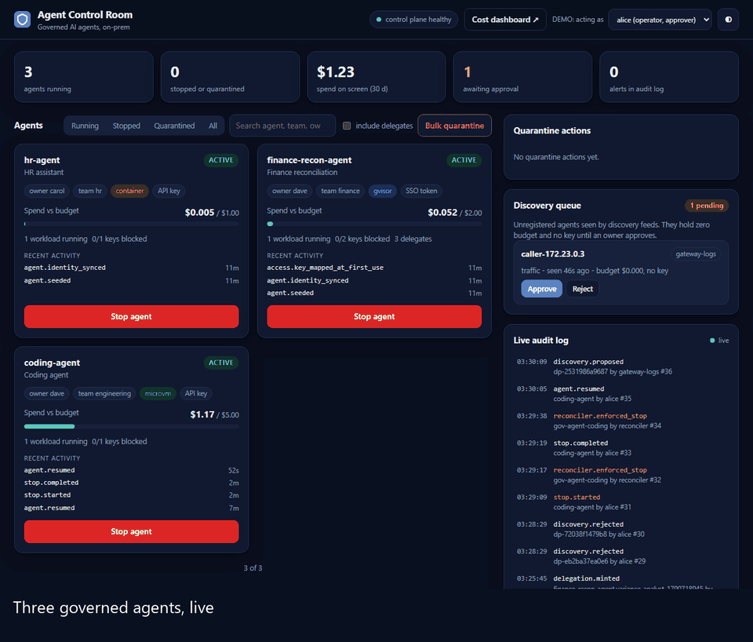
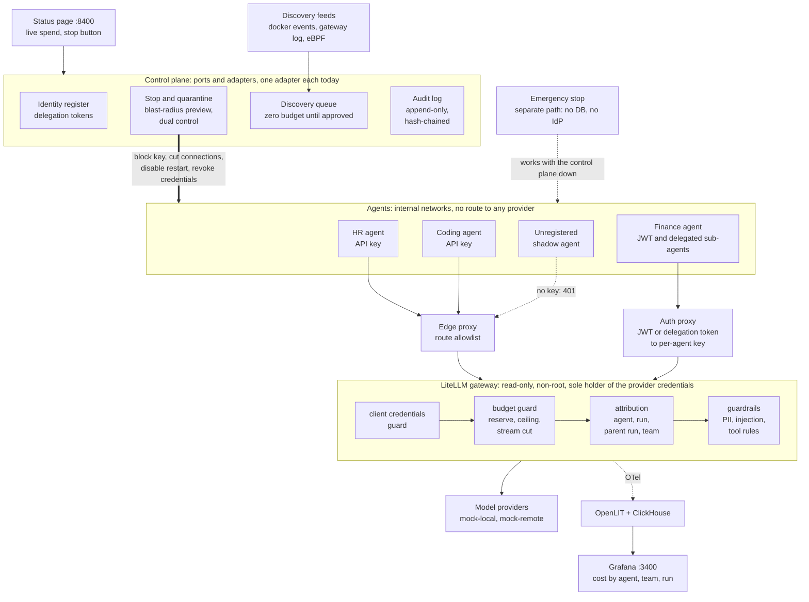

# Governing AI agents on-prem

A working pilot of the control layer that keeps AI agents inside a budget, inside a boundary, and stoppable.
It runs on one laptop with Docker, uses mock model providers (no spend, no credentials), and every claim below is
measured by `scripts/acceptance.sh`, which reports failures and simplifications as plainly as passes.



*The recording is `scripts/demo.sh` (about two and a half minutes) seen through the status page, then the Grafana cost view.
Re-record it with `scripts/record_demo_gif.py`. Stills: [rogue spend](docs/assets/status-rogue-spend.png),
[stopped](docs/assets/status-stopped.png), [cannot restart](docs/assets/status-cannot-restart.png),
[shadow agent in the discovery queue](docs/assets/status-discovery.png), [audit trail](docs/assets/status-audit.png),
[Grafana cost dashboard](docs/assets/grafana-cost.png).*

## The problem

Teams are putting AI agents into production faster than they can govern them. Three failures show up first.

- **Cost runaway.** A looping agent, a retry storm or one oversized `max_tokens` can spend a month's budget in minutes.
  The gateway this pilot builds on enforces budgets natively, but this pilot measured it overshooting a hard cap by up
  to 10.9x in specific cases (see [Findings](#findings)).
- **Rogue agents.** "Turn it off" is not one action. It is the key, the live connections, the container's restart
  policy, the downstream credentials and the requests already in flight. Miss one and the agent is not stopped.
- **Shadow agents.** Anyone can start a container that calls a model. If nothing sees it, nothing budgets, attributes
  or stops it.

## What this is

Agents can reach models only through one gateway (LiteLLM, open-source edition), on Docker networks that have no route
to any provider. Four small gateway callbacks close the gaps measured in the gateway's own budget enforcement, refuse
agent-supplied provider credentials, stamp every request with agent, run, parent run and team, and enforce PII and
injection rules that fail closed or degrade by data classification. A thin control plane keeps the agent identity
register and runs the stop sequence (block key, cut live connections, disable restart, revoke credentials, verify),
dual-control quarantine with a blast-radius preview, delegation tokens that can only narrow, an append-only
hash-chained audit log and a discovery queue where unregistered callers wait with zero budget. A separate emergency
stop works when the control plane is down. Everything environment-specific sits behind small interfaces, so adopting
this in another environment means writing adapters, not rewriting the core.

## Architecture



(Static copy of the diagram: [docs/assets/architecture.png](docs/assets/architecture.png).)

Where the brakes are, from the outside in:

1. **Network.** Agents sit on internal Docker networks. Only the allowlisting edge proxy (inference routes, nothing
   else) and the auth proxy face them; only the gateway reaches providers and holds their credentials.
2. **Gateway callbacks** (`deploy/litellm/callbacks/`): refuse agent-supplied credentials, reserve worst-case cost before
   a call and cut a stream that outruns its reservation or whose key was blocked, attribute every request, apply PII
   and injection rules.
3. **Stop** (`POST /v1/agents/{id}/stop`): the five-step sequence, verified, in seconds; a reconciler keeps the agent
   stopped when someone restarts the container.
4. **Emergency stop** (`:8190`): the same brakes through the gateway admin API and Docker only, with its own credential.
5. **Discovery**: feeds watch Docker events, the gateway's access log and (optionally) eBPF, and file unregistered
   callers as pending proposals with zero budget.

## Proof

Measured by one unattended clean-room run of `scripts/acceptance.sh --fresh` (60 min) on a laptop-class Docker Desktop
host ([full report](docs/results/ACCEPTANCE.md), including what each test simplifies).

| Claim | Measured | Test |
|---|---|---|
| Stop latency | New requests of a stopped agent are refused **0.12 s** after the decision (target: 30 s); the full stop sequence, verification included, takes 6.2 s. An agent holding a still-valid login token (892 s left) is refused after 0.12 s | S8-01, S8-02 |
| Stop with the control plane down | Emergency stop with **6 components down** (control plane and its database, status page, Grafana, OpenLIT, ClickHouse): agent stopped and verified in **2.9 s** | S8-08 |
| In-flight requests | Billing ends 0.3 to 0.8 s after a stop, streamed or buffered | S8-03 |
| Zero overshoot | 60 parallel requests and 40 parallel streams against a $0.002 cap: $0.001863 spent. **21 gateway restarts, SIGKILLs and re-creates: 0 overshoots.** Simulation: 0 of 5 keys and 3 teams over their cap | M-02, M-02b |
| Gateway overhead | Provider-free overhead p50 28.7 / **p95 50.5** / p99 75.3 ms (budget: p95 150, p99 300); under load p95 65.4 ms. Guardrails add p95 of at most 39 ms on an 8,000-token prompt with PII | M-08, M-07, simulation |
| 1,000+ request simulation | **1,039 requests** by three agents in 5.1 min, 0 unattributed. A rogue episode was detected 1.2 s after it began and contained 6.0 s after it began; spend growth after the stop: $0 | pilot simulation |
| Fail closed | Guardrail engine down: confidential agent refused (503) after 2.5 s. Redis down: 503. Postgres down: first refusal after 3.7 s. Gateway down: no model traffic. Control plane down: SSO route 503. OpenLIT down: enforcement and latency unchanged (p50 98.4 to 98.8 ms) | M-04a to M-04f |
| Shadow agent | An unregistered container calling the gateway is a pending proposal after **1.0 s**, with budget $0 and no key; its calls got 401 | S8-05 |
| No bypass | 17 probes from the agent networks (providers, Postgres, Redis, Presidio, control plane, internet) all blocked; no provider or master key in any agent container | S8-04 |
| Quarantine | 4 agents in 2 teams contained 9.0 s after the second approver; a revived container was re-stopped in 2.4 s; LLM tokens after the network cut: 0 | S8-06, S8-09 |
| Attribution | Every one of 1,377 requests in the test window attributed to agent, run and team (0 unattributed); runs aborted before a call of their own are accounted for from the agents' run journal | M-01 |
| Everything | **28 of 28 acceptance tests pass**; the eight component suites add 615 tests (hardening 68, foundation 32, policy 58, control 110, discovery 44, agents 141, guardrails 125, budget 37), all passing in the same run | `scripts/acceptance.sh --fresh` |

## Findings

**Native LiteLLM overshoots found and closed** (LiteLLM v1.100.3, native budget reservation on; every case reproduced
by a test that asserts the gap and another that asserts the guard closes it, `docs/results/T2.md`):

| Case | Native result | With the budget guard |
|---|---|---|
| Last request admitted on a partial reservation (no concurrency needed) | +3.5% on a $0.002 cap, +50.4% with 1000-token completions | refused or clamped: at or under the cap |
| `max_tokens=100000` forwarded past the reservation | 4.1x the cap in one request | 400 above the agent's ceiling |
| Fallback to a pricier model priced on the requested model only | +51.7% over the cap in one request | affordability checked on every reachable model |
| Provider that ignores `max_tokens` (runaway stream) | 10.9x the reservation | stream cut at the reservation, audited |
| Gateway restart inside the spend-write window, then idle | +107% (counter expired, reseeded from a lagging database) | counter kept for the budget period; 0 overshoots in 21 restart, kill and recreate drills |
| Postgres down | 12 budgeted requests admitted over about 90 s from cache | refused within about 4 s |

**Two real bugs found by integrating the parts** (each passed its own component's tests):

- *A stop did not stop a buffered stream.* The guardrails buffer streamed output, so the network cut never reached the
  gateway's upstream call and the provider generated to `max_tokens` (29 s, full cost). The budget guard now re-checks
  the key every second mid-stream and closes the upstream once it is blocked (in-flight billing ends 0.3 to 0.8 s after
  a stop).
- *A resume racing the reconciler left an agent "running" with a dead key.* Found by the second pilot simulation; the
  reconciler now re-reads desired state around a re-block and reverts one that raced a resume.

**Found by review afterwards**, also closed: an agent could bring its own provider `api_key` or `extra_headers` through
the gateway (native LiteLLM blocks only `api_base`), and a wrong key put the shared deployment into cooldown for
everyone; and the attribution test failed on parent runs that were aborted before they made a call of their own, which
the agents' durable run journal now accounts for without a tolerance. Both are written up in
[ACCEPTANCE.md](docs/results/ACCEPTANCE.md#changes-made-after-the-t9-reviews-full-run-27-of-28-m-01-failed).

## Quick start

Needs Docker (Desktop or Engine), Git Bash or any POSIX shell, and Python 3.12 or newer for the tooling.

```bash
python -m venv .venv
.venv/Scripts/pip install -r tests/control/requirements.txt      # Linux/macOS: .venv/bin/pip
bash scripts/up.sh          # everything, in dependency order; about 10 min cold, 2 min warm
```

- Status page: <http://127.0.0.1:8400> (agents, live spend, stop button, discovery queue, audit log)
- Cost dashboard: <http://127.0.0.1:3400/d/govpilot-cost> (Grafana, anonymous read-only on localhost)
- Control plane API: <http://127.0.0.1:8100/docs>

```bash
bash scripts/demo.sh        # the walkthrough shown above (about 2.5 min), narrated in the terminal
bash scripts/acceptance.sh  # every test, 60 to 90 min unattended; writes docs/results/ACCEPTANCE.md
bash scripts/down.sh        # stop everything (add --volumes to also delete data)
```

Operator procedures (stop, quarantine, emergency stop, break-glass, backup and restore, rollback):
[docs/runbook/README.md](docs/runbook/README.md).

## Designed for adoption

The control plane talks to the outside world only through ports (`services/control-plane/govcp/domain/ports.py`).
Each has one adapter today, chosen by `adapters.<port>.type` in `deploy/control-plane/config.yaml`, and a contract
test suite (`tests/control/contracts/`) that a new adapter must pass.

| Port | Today | A sponsor swaps in |
|---|---|---|
| `IdentityProvider` | stand-in OIDC issuer (RS256, JWKS) | corporate OIDC (Keycloak, Entra, Okta), SCIM disable |
| `Orchestrator` | Docker (stop, restart policy, labels) | Kubernetes: scale to 0, suspend jobs |
| `NetworkQuarantine` | `docker network disconnect` plus TCP resets | NetworkPolicy or Cilium plus a conntrack flush |
| `GatewayAdmin` | LiteLLM admin API | another gateway's admin API |
| `SecretStore` | file | Vault |
| `CredentialRevoker` | via the secret store | per-system revokers (database roles, MCP tokens, PKI) |
| `DiscoveryFeed` | Docker events, gateway log, eBPF controller | Kubernetes watch, cloud inventory |
| `AuditSink` | Postgres, append-only, hash-chained | SIEM forwarder (Postgres stays as the local copy) |

Outside the control plane the same rule holds: teams, agents, budgets and models live in `deploy/agents.json`,
guardrail rules and fail modes in `deploy/guardrails/guardrails.yaml`, policy in signed bundles under `policy/`, and the
gateway callbacks take their event sinks and policy sources as small protocols. The agent library (`agents/govagent`)
is standard-library Python: run ids, retries that keep the run id, tool and delegation runs, and a durable run
journal, whatever framework the agent itself uses.

## Limitations and simplifications

Stated plainly, because a recruiter or a sponsor should not have to find them.

- **Mock providers.** Model traffic goes to two deterministic mock providers. No real provider's cancel semantics
  (does it stop generating when the gateway drops the call?) were measured.
- **Docker stands in for Kubernetes.** Network isolation, stop and quarantine use Docker networks, labels and restart
  policies. Sandbox tiers (`container`, `gvisor`, `microvm`) are labels enforced at admission, not real runtimes.
  Docker Desktop has no `SOCK_DESTROY`, so live connections are cut with injected TCP resets.
- **One of everything.** One host, one gateway replica, one Postgres, one Redis. No high availability or failover;
  after a Redis outage enforcement recovers about a minute later (fail closed meanwhile).
- **Identity.** A stand-in OIDC issuer; certificate (mTLS) agents are not built.
- **Stop is an operator's decision.** Nothing in the platform decides to stop an agent by itself; the pilot simulation
  uses a spend-rate watchdog script to show the loop closing.
- **In-window harm** is prevented only where a chokepoint asks the control plane at commit time (the mock tool
  gateway does). An agent holding raw database credentials is contained 1 to 4 s after the decision, not before.
- **Guardrails** are English-only, one analyzer instance, and semantics during an engine outage differ by data class
  (documented and tested).
- **Policy approval** is a commit with a reviewer trailer in a scratch repository, not a hosted pull request with
  branch protection; the signing key is an unencrypted file.
- **Discovery is noisy in one case.** The gateway-log feed can propose a registered agent by its IP address
  (`caller-172.x.x.x` in the queue, seen for the HR agent) instead of recognising it; a human rejects the proposal.
- **The status page** is unauthenticated on localhost by design (it holds operator credentials); its persona picker is
  a demo device for the two-approver rule.
- **Not done:** five business days of supervised traffic, an external security review, a named operator and support rota.

## Repository map

| Path | What |
|---|---|
| `deploy/` | Compose files (base, hardening overlay, control plane, observability, discovery, agents, status page), gateway config and callbacks, agent budgets, guardrail rules |
| `services/control-plane/` | Identity register, stop, quarantine, discovery, delegation, audit, IdP stand-in, auth proxy, emergency stop |
| `services/guardrails/`, `services/policy/`, `services/discovery/`, `services/status-page/`, `services/mock-provider/` | Guardrail engine, signed policy bundles, discovery feeds, the status page, the mock providers |
| `agents/` | `govagent` library and the three sample agents (HR, finance reconciliation, coding) |
| `policy/` | Policy as code: tiers, teams, agents, trusted public key |
| `scripts/` | `up.sh`, `down.sh`, `demo.sh`, `acceptance.sh`, operator CLIs (`agents_ctl.py`, `attribution_report.py`, `run_journal.py`), backup and restore |
| `tests/` | `acceptance/` (28 tests: the twelve tests of the design report's section 8 and the sixteen pilot acceptance criteria), plus one suite per component |
| `docs/results/` | One report per task and the generated acceptance report; `docs/runbook/` operator procedures; `docs/assets/` demo recording and stills |
| `release/` | Image digests and SBOMs |

## License

MIT, see [LICENSE](LICENSE). The stack runs third-party software as unmodified container images (LiteLLM, OpenLIT,
Presidio, Grafana, ClickHouse, PostgreSQL, Redis, nginx) under their own licenses, two of which need a decision before
any redistribution (Grafana is AGPL-3.0; Redis 7.4 is source-available). See
[THIRD_PARTY_NOTICES.md](THIRD_PARTY_NOTICES.md) and the SBOMs in `release/sbom/`.
