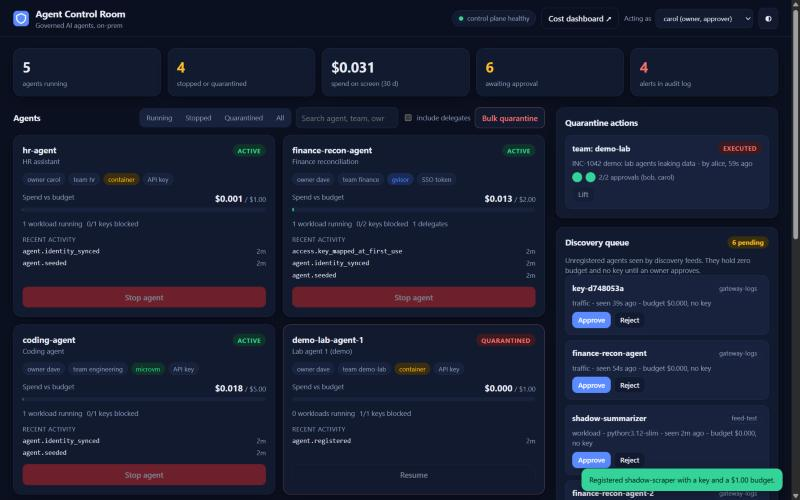
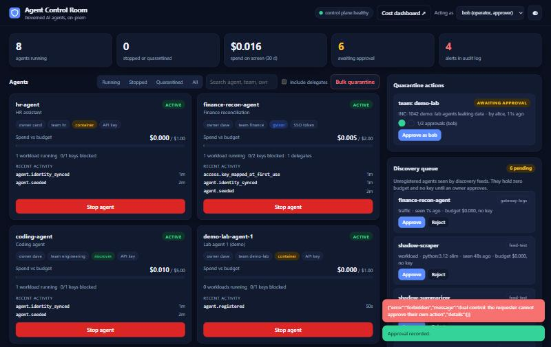
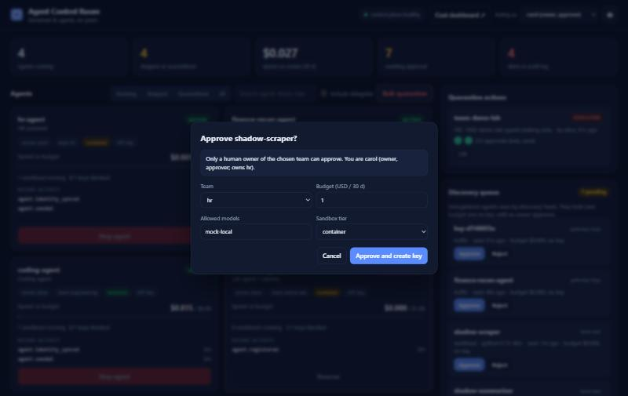
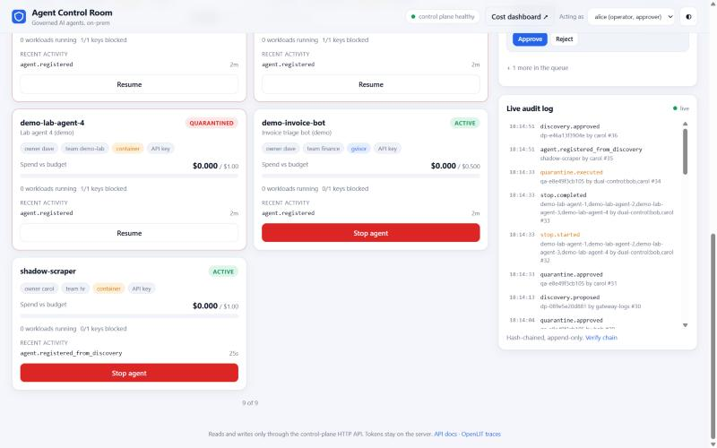

# T10a results: recruiter-facing agent status page

Date: 2026-09-29. Result: **working and verified in a browser against the live control plane** (stop, two-approver quarantine, discovery approval, live audit feed, light/dark, mobile width).

`http://127.0.0.1:8400` (`bash scripts/status-page-up.sh`; compose project `govpilot-status-page`, container `gov-status-page`; 8400 was free). It is one small container (FastAPI backend + vanilla JS, no framework, no build step, no CDN). It joins only `govpilot_cpinternal` (to reach the control plane and IdP) and `govpilot_control` (to publish the port on localhost). No DB, no Docker socket, read-only root filesystem, all capabilities dropped.

## What it shows

| Requirement | Where |
|---|---|
| Each agent: owner, team, sandbox tier, status, auth type | agent cards |
| Live spend vs budget with progress bar (amber at 80 %, red at 100 %) | card, from `GET /v1/agents/{id}/live`, refreshed every 3 s |
| Recent requests | card "Recent activity": the agent's latest audit events (see gap 1) |
| Stop per agent, with confirm | red button -> dialog explains the sequence, requires a reason, then shows the verified result; Resume on stopped agents |
| Bulk quarantine with blast-radius preview and two-approver rule | "Bulk quarantine": pick team / image / whole fleet, **Preview** shows agents, running workloads, keys, credentials, unregistered look-alikes and the agent list; fleet-wide selectors show the "two different humans, neither of them you" banner; the action then sits in "Quarantine actions" with an approvals meter until two people approve; Lift reverses it |
| Pending discovery queue, approve / reject | "Discovery queue": approve dialog (team, budget, models, tier) creates the agent and key; reject records a reason |
| Live audit feed | "Live audit log" (2.5 s polling, new rows flash, alerts in red) with a **Verify chain** button that calls `/v1/audit/verify` |
| Link to the Grafana cost dashboard | header button (`GRAFANA_PUBLIC_URL`, default `http://127.0.0.1:3400`); footer links to OpenLIT and the API docs |

Also: dark/light theme (follows the OS, toggle remembered), responsive down to phone width, KPI strip, status filter chips, search, "include delegates" toggle, keyboard-focusable dialogs, reduced-motion respected.

## Design

```
browser  --/api/*-->  status-page backend  --Bearer JWT-->  control-plane API :8100
 (no tokens)          (tokens per persona,  --password grant--> IdP :8300
                       cached server-side)
```

* **Swappable:** the only integration points are `CP_URL` and `IDP_TOKEN_URL`. The backend uses documented endpoints only (`/v1/agents`, `/live`, `/stop`, `/resume`, `/v1/quarantine/*`, `/v1/discovery/*`, `/v1/audit`, `/v1/alerts`, `/v1/me`). Anything that speaks the same API works; nothing reads a database or Docker.
* **Tokens never reach the browser.** The backend logs in as the IdP users (passwords come from `.local/control-plane.env` through compose interpolation, never printed or baked into the image), refreshes tokens before expiry and retries once on 401.
* **Personas.** The two-approver rule and "only a team owner can approve a discovery" are real control-plane rules, so a single operator token cannot demonstrate them. The header has an "Acting as" picker (alice operator/approver, bob operator/approver, carol owner of hr, dave owner, erin viewer). The browser sends only a persona name, validated against the configured list; the control plane still enforces roles (a viewer's buttons are disabled and the API would refuse them anyway). Alice requesting a fleet-wide quarantine and then approving it herself is refused by the control plane ("the requester cannot approve their own action"); bob then carol satisfies it.
* Writes need an `X-Requested-With: status-page` header (cross-site forms cannot set it); all responses are `no-store`; all data is inserted with `textContent`, never `innerHTML`.
* `STATUS_HIDE_PATTERN` (default `^t[0-9]`) hides test-fixture agents and teams left by the automated suites (`t3a-...`, `t3dlg-...`). It is presentational; set it empty to see everything.

## Verified in the browser (live stack)

1. Page loads with live data (3 seeded agents, spend bars moving, audit feed, discovery queue, health pill).
2. Stop: `demo-invoice-bot` stopped from the confirm dialog; it turned red, KPIs updated (earlier run, before T8 reset the stack).
3. Bulk quarantine: team `demo-lab` (4 throwaway agents) previewed as fleet-wide; alice requested it; alice's own approval was refused with the control plane's message; bob then carol approved; status went to executed and the four agents showed as quarantined; **Lift** restored them. The audit feed showed `quarantine.previewed/approved/executed`, `stop.started/completed` live.
4. Discovery: carol approved `shadow-scraper` (registered with a key and a $1.00 budget, audit `discovery.approved` / `agent.registered_from_discovery`).
5. Verify chain: "36 records intact".
6. Light theme and 375 px width render correctly.

Screenshots (`docs/results/T10-assets/`):






## Gaps and notes for T8 / the sponsor

1. **No per-request log in the control-plane API.** "Recent requests" is the agent's recent audit activity (registered, key mapped, stopped, delegation denied, ...). Per-call requests live in the gateway spend logs / ClickHouse (Grafana). To show them here without breaking the "control-plane API only" rule, add `GET /v1/agents/{id}/requests` to the control plane (reading the gateway's spend log through the GatewayAdmin port) and render it in the same card.
2. The card set is capped to 24 per page and `/live` is fetched only for agents on screen (one call each, cached 2.5 s), so a register with hundreds of agents stays cheap.
3. The demo agents `demo-invoice-bot`, `demo-lab-agent-1..4` and `shadow-scraper` were created in the live register for testing; remove or ignore them. The stack was reset by T8 mid-task, so the numbers above are from the fresh register.
4. The `gateway-logs` feed proposed already-registered agents (`finance-recon-agent`, `finance-recon-agent-2`) as "traffic" after the reset; that is T6/T8 behaviour, the page just shows what the queue holds.
5. The page is unauthenticated on localhost by design (it holds operator credentials). Bind it to 127.0.0.1 only, or put it behind the corporate SSO proxy and map the signed-in user to the persona instead of the picker.

## Files

`services/status-page/` (`Dockerfile`, `requirements.txt`, `app/main.py`, `app/static/{index.html,style.css,app.js}`), `deploy/compose.status-page.yml`, `scripts/status-page-up.sh`, `docs/results/T10a.md`, `docs/results/T10-assets/`.
