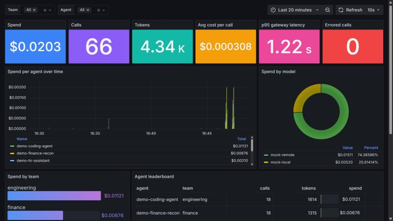

# T6 results: observability and discovery

Date: 2026-09-29. Result: **37/37 T6 tests pass** (`tests/discovery`: 31 unit/contract tests with no Docker, 6 live tests), and `tests/foundation` was **31/31** when I checked after moving the gateway twin off the providers network (deviation 2); later failures there come from other tasks' containers (T4 agents on `govpilot_agents`, T5 mock on `govpilot_providers`) and T2 gateway changes, not from T6 containers.

| Acceptance (PILOT-PLAN T6) | Result |
|---|---|
| OpenLIT + ClickHouse + Grafana | up, pinned, own compose project (`deploy/compose.observability.yml`) |
| Gateway telemetry into OpenLIT | proven end to end through an OTel-enabled gateway twin; one-line change for the real gateway below |
| Cost per agent / team dashboard | provisioned Grafana dashboard, screenshot below |
| OpenLIT Controller eBPF discovery | **works on Docker Desktop / WSL2**, with two caveats (see eBPF section) |
| docker-events discovery feed -> pending queue | live, per-feed rate limit, evidence attached |
| Unregistered service making an AI call appears in the pending queue and can spend nothing | live test: proposal after **2.1 s**, both gateway attempts refused (401), no key exists, budget 0 |

## What runs

| Container | Image (pinned) | Host port (127.0.0.1) | Role |
|---|---|---|---|
| gov-obs-clickhouse | clickhouse-server 24.4.1 | 8124 (HTTP) | telemetry store (OpenLIT's own pin) |
| gov-obs-openlit | ghcr.io/openlit/openlit 2.1.0 | 3300 (UI), 4318 (OTLP/HTTP) | OpenLIT UI + built-in OTLP receiver/collector |
| gov-obs-grafana | grafana-oss 11.6.1 + ClickHouse datasource 4.11.2 | 3400 | provisioned cost dashboard, anonymous read-only on localhost |
| gov-gateway-otel (+ gov-obs-mock-local/-remote) | litellm v1.100.3 | 4200 | OTel-enabled twin of the gateway (profile `gateway-demo`) |
| gov-obs-controller | ghcr.io/openlit/openlit-controller 0.10.0 | none (REST on :4321 inside `govpilot_obs`) | eBPF discovery (profile `ebpf`) |
| gov-discovery | govpilot/discovery:1 (built from `services/discovery`) | none | the three discovery feeds |

Bring up: `bash scripts/observability-up.sh gateway-demo ebpf` then `bash scripts/discovery-up.sh` (both idempotent; secrets in gitignored `.local/observability.env`, `.local/discovery.env`). Demo traffic: `.venv/Scripts/python deploy/observability/demo_traffic.py` (mints throwaway `demo-*` keys, never touches the real agents' keys). OpenLIT first login is its documented default (`user@openlit.io` / `openlituser`); change it if you ever expose the port.

Files: `deploy/compose.observability.yml`, `deploy/observability/` (ClickHouse config/init from OpenLIT 2.1.0, OTel collector config, `build_dashboard.py` -> `grafana/dashboards/cost-by-agent.json`, Grafana provisioning, `make-gateway-config.py`, `demo_traffic.py`), `deploy/compose.discovery.yml`, `deploy/discovery/config.yaml`, `services/discovery/`, `scripts/observability-up.sh`, `scripts/discovery-up.sh`, `scripts/discovery_clients.py`, `tests/discovery/`.

## 1. Gateway telemetry, and the line the T2 owner has to merge

I did not edit `deploy/litellm/config.yaml` or restart `gov-gateway` (other tasks own them and use it). Instead `deploy/observability/make-gateway-config.py` derives `.local/observability/litellm-otel.yaml` = the real config + the `otel` callback, and the `gateway-otel` twin runs on it (same image, same Postgres/Redis, its own copies of the two mock providers so it stays off `govpilot_providers`).

**To send the real gateway's telemetry, merge this (three edits, all in T2-owned files):**

```yaml
# deploy/litellm/config.yaml
litellm_settings:
  callbacks: ["callbacks.budget_guard.budget_guard", "otel"]      # add "otel"

# deploy/docker-compose.yml, service gateway
    environment:
      OTEL_EXPORTER: otlp_http
      OTEL_ENDPOINT: http://openlit:4318
      OTEL_SERVICE_NAME: govpilot-gateway
    networks:
      obs: {}                                                     # + top-level:  networks: obs: {name: govpilot_obs, external: true}
```

(`scripts/observability-up.sh` must have run first so the `govpilot_obs` network exists.) `govpilot_obs` carries only telemetry; agents never join it.

What arrives per call (span `litellm_request`): `gen_ai.cost.total_cost` (LiteLLM's own USD figure), token counts, model, streaming flag, `metadata.user_api_key_alias/_hash`, team alias, key metadata (`agent_id`, `owner`), the request's `metadata` (so a `run_id` sent by the agent shows up), duration, status. That is enough for T4's attribution acceptance line to be queryable in ClickHouse; T4 only needs to add `parent_run_id` to the request metadata.

**Privacy finding:** the spans also carry `gen_ai.input.messages` / `gen_ai.output.messages`, i.e. full prompts and answers, in ClickHouse. For real data set `litellm_settings.turn_off_message_logging: true` (not verified here; the mock traffic is harmless) and/or add a ClickHouse TTL.

### Dashboard: `Cost by agent and team`



`http://127.0.0.1:3400` (home dashboard). Stat tiles (spend, calls, tokens, cost per call, p95 latency, errors), stacked spend per agent over time, spend by model, spend by team, agent leaderboard (spend, cost per call, p95, errors), most expensive runs by `run_id`, team/agent filters, 10 s refresh. It is generated by `deploy/observability/build_dashboard.py` so the SQL stays readable; the ClickHouse datasource and the dashboard are provisioned from files, nothing is clicked together. OpenLIT's own UI (`:3300`) shows the same traces (requests, costs, tokens) and is useful for span drill-down.

## 2. OpenLIT Controller eBPF discovery on Docker Desktop / WSL2

**Outcome: it runs and it discovers, with two caveats.**

Setup: `ghcr.io/openlit/openlit-controller:0.10.0`, `privileged`, `pid: host`, docker socket, `/sys/kernel/debug`, cgroup mount. The WSL2 kernel (6.18.40, `CONFIG_BPF_SYSCALL`, `KPROBES`, `DEBUG_INFO_BTF` all `y`, `/sys/kernel/btf/vmlinux` present) loads the BPF program and attaches the `tcp_v4_connect` / `tcp_v6_connect` kprobes without a warning. Test: a container that opens a TCP connection (handshake only, no bytes sent, no credentials, no spend) to `api.openai.com:443` appears in the controller's `GET /api/services` as `{service_name: <container name>, llm_providers: [openai], language_runtime: python, pid, exe_path}` in **about 5 to 30 s** (17 s in the recorded test run). Nothing else on the box was flagged except OpenLIT's own ClickHouse (it talks to a Cloudflare-fronted host that shares an IP with an LLM endpoint; a false positive from IP matching, which is why the feed proposes and a human decides).

Caveat 1, **the controller's backend is enterprise-only in OpenLIT 2.1.0.** The controller polls `POST /api/controller/poll` on the OpenLIT server; the OSS edition answers 404 (`isControllerProductEnabled()` is false unless `OPENLIT_EDITION=enterprise|cloud`). I did not flip that flag (no Enterprise features, same rule as for LiteLLM). Consequences: the controller logs `poll failed` every 15 s (harmless), the "Agents" page in the OpenLIT UI stays empty, and its remote config (custom LLM hosts, instrumentation actions) is unavailable. The controller's local REST API (`/api/services`, `/api/status`) is unaffected, and that is what `openlit-controller` feed reads.

Caveat 2, **it only sees endpoints it knows.** Built-in hosts are public SaaS providers on :443 (OpenAI, Anthropic, Gemini, Mistral, Bedrock regions, ...). Internal endpoints such as `gateway:4000` can only be added through the (enterprise) backend config, so agents calling our own gateway are invisible to it. That fits its role here: it detects containers that go **around** the gateway straight to a provider. The gateway-side view is covered by the other two feeds.

Detection is not instant and is not perfectly reliable: in early manual runs a container that connected once was reported only after a long delay, so the live test reconnects every 4 s during its lifetime. Treat eBPF as a second, independent signal, not the only one.

## 3. Discovery service (`services/discovery/`)

One process, three feeds, each authenticated to the control plane as its **own** IdP client with role `feed` (the control plane takes the feed name from the token subject, so a feed cannot spend another feed's quota or file under another name). `docker-events` is a static client from the T3 config; `scripts/discovery_clients.py` registers `gateway-logs` and `openlit-controller` through the IdP admin API (no edits to T3 files).

| Feed | Sees | Proposal |
|---|---|---|
| `docker-events` (a) | containers attached to a governed network (`govpilot_agents`, `govpilot_agents_sso`) or labelled `govpilot.discover=true`; baseline of running ones, then `create/start/connect` events, plus a reconcile against the running list; must still be running after `settle_s: 5` | kind `workload`, fingerprint `container:<name>:<image>`, evidence: image, all labels, networks, created/started, first-seen, compose project, **probable owner/team from labels** (`govpilot.owner`, `owner`, `org.opencontainers.image.authors`, `maintainer`; `govpilot.team`, `team`) |
| `gateway-logs` (b) | (1) gateway access log: 401/403 on AI routes, source IP mapped to a container on a governed network (or, if it is already gone, reported by IP when the IP is inside a governed range); (2) gateway OTel spans in ClickHouse: a virtual key that made calls and is not in the register | kind `traffic`; refused calls carry count/statuses/paths and `spent_usd: 0`; key proposals carry alias, hash prefix (never the key), team, calls, spend, models, first/last seen |
| `openlit-controller` (c) | the controller's `/api/services` | kind `traffic`, `ebpf` evidence block (providers, runtime, pid, exe, `bypasses_gateway: true`), enriched with the container's labels when the name matches |

The same container seen by two feeds folds into one proposal (same fingerprint); registered agents are never proposed: the control plane recognises them by the `govpilot.agent_id` label (containers) that the feed passes through, and for keys by the `agent_id` in the key metadata. The feeds therefore never read the register and hold no gateway admin credential (the gateway feed reads the telemetry in ClickHouse and the access log through the Docker API).

**Rate limits.** The control plane's per-feed daily cap stays authoritative (429 + `discovery.rate_limited` audit record). The runner mirrors it (`daily_limit` per feed in `deploy/discovery/config.yaml`), so it stops calling once the day's budget is used, keeps unsent observations in a bounded backlog (200, oldest dropped and counted) and resumes after UTC midnight. Only *created* proposals count; duplicates and known agents are free. Budget, seen fingerprints and backlog persist in `/data/state.json`, so a restart neither resets the budget nor re-files rejected fingerprints.

**Ports and adapters** (loose coupling; `wiring.py` is the only file naming adapter classes, choice is config): `DiscoveryFeed` (same contract as the control plane's port, judged by the control plane's own `assert_feed_contract` through a shim in `tests/discovery/test_feed_contract.py`), `ProposalSink` (control-plane HTTP), `ContainerSource` (Docker SDK -> k8s pod lister), `AccessLogSource` (`docker logs` -> any log platform), `CallRecordSource` (ClickHouse -> any telemetry store), `ServiceListSource` (controller REST).

## 4. Tests (`tests/discovery`)

Run: `.venv/Scripts/python -m pytest tests/discovery` (unit and contract tests need nothing running; live tests need the T1 stack, control plane, `gov-discovery`; two need the observability profiles and skip otherwise).

| Test | Proves |
|---|---|
| test_feeds_unit (20) | baseline/new-only semantics, governed-network and platform filters (name, label, compose project), settle window, refused-call parsing, unresolvable callers, unregistered keys folded via label, thresholds, source failures non-fatal, eBPF enrichment |
| test_runner_unit (8) | client-side cap stops a noisy feed with zero wasted calls; server 429 authoritative; backlog held and resumed after midnight; overflow drops oldest; duplicates/known are free; retries vs permanent rejects; broken feed isolated; state persists |
| test_feed_contract (3) | each feed passes the control plane's DiscoveryFeed contract |
| live: unregistered container | container on `govpilot_agents` calls the gateway with no key and a made-up key: **proposal pending after 2.1 s** (gateway-logs feed in the recorded run), budget 0, no gateway key, image/labels/first-seen/probable owner present, both calls got **401** and the gateway log shows the 401 from its IP, no LiteLLM key with its alias, not in the register |
| live: registered workload | a container labelled with a registered agent id is not proposed |
| live: unregistered gateway key | key minted outside the register, used through the OTel twin: proposal after ~7 s, evidence has calls/models, no key material |
| live: eBPF bypass | container on the default bridge (not governed) that connects to api.openai.com: proposal from `openlit-controller` (17 s) with the `ebpf` evidence |
| live: noisy feed | a feed emitting 40 things against the real control plane: **20 proposals** (control plane default cap), one 429, 20 held back, audit record present, no further calls |
| live: client cap | cap 5: exactly 5 calls made, 5 proposals, 7 held |

Measured numbers land in `.local/t6-results/*.json`. Tests reject the proposals they create; the throwaway containers carry the label `govpilot.t6test=1` and are removed.

## Deviations and findings

1. **`gov-gateway` was not touched.** Real-gateway telemetry needs the merge above; the demo runs on the twin. Until merged, the `gateway-logs` key stream and the dashboard show only twin traffic (T4's agents should call the merged gateway).
2. **The twin first joined `govpilot_providers`, which broke T1's "only the gateway reaches providers" test (30/31).** Fixed: it now has private mock providers on `govpilot_obs_providers` (internal), plus `govpilot_backend` (Postgres/Redis) and `govpilot_obs`. `tests/foundation` is 31/31 again.
3. **Docker socket mounted into `gov-discovery`** (read-only use by the code: list/inspect/events/logs), and into the controller (privileged, host PID). Root-equivalent on the host; a Kubernetes deployment would use a read-only namespaced service account and the controller's k8s mode.
4. **Short-lived containers are a blind spot of the docker feed** (`settle_s`, needed because the T1 tests and health probes start containers on the agents network for a second). A one-second rogue that actually calls the gateway is still caught by the access-log feed (by IP); one that goes straight to a provider is caught by eBPF if the probe fires.
5. **Control-plane gap noticed, not fixed (T3 owns it):** `DiscoveryService.submit` treats any workload carrying a registered `govpilot.agent_id` label as "known". A rogue container that simply copies that label is silently folded instead of proposed. The reconciler/quarantine path may still notice it, but discovery will not. Suggest requiring the label to match a container the orchestrator actually started for that agent.
6. **Queue hygiene:** the T3 tests and my own early runs left proposals in the pending queue; I rejected everything pending at the start of the final run (reason "T6 development cleanup"), including T3 test proposals.
7. **Start-up replay:** on (re)start the gateway feed looks back 10 minutes, so a restart can re-file a caller that was already rejected if its fingerprint is not in the state file (state is persisted, so this only happens after a volume wipe).
8. **Provisioned Grafana** is read-only (`allowUiUpdates: false`): edit `build_dashboard.py` and regenerate. Anonymous viewer is enabled for the demo (localhost only).
9. **Not done:** alerting rules on the dashboard data; Grafana panel for the discovery queue (the queue lives in the control-plane DB, T10's status page is the right place); the `openlit-controller` feed cannot use custom LLM hosts (enterprise backend).
